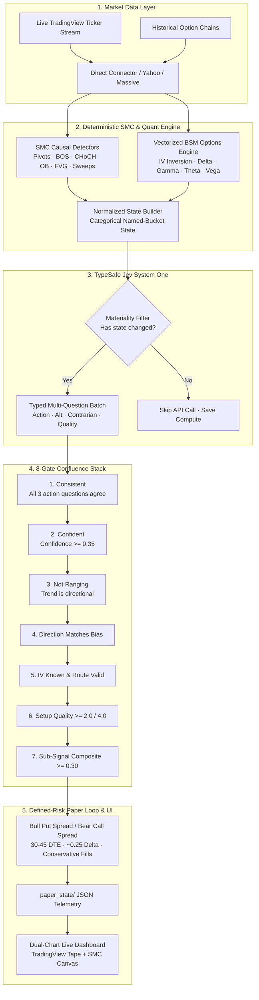

# ⚡ Sweep · Autonomous Smart Money Concepts & Options Trading Engine

[](https://python.org)
[](https://tradingview.com)
[](https://typesafe.ai)
[](https://github.com/Shashank200345/Sweep)
[](https://github.com/Shashank200345/Sweep)
[](https://github.com/Shashank200345/Sweep)
[](https://github.com/Shashank200345/Sweep)
[](NOTICE)

> **Sweep** detects **Smart Money Concept (SMC)** institutional market structure (Swing Pivots, BOS/CHoCH, Order Blocks, Fair Value Gaps, Liquidity Sweeps, Premium/Discount Zones) on 1-hour SPY candles with daily macro bias, computes analytical options mechanics (BSM Greeks, IV Rank) via vectorized mathematics, and gates all trade entries through **TypeSafe's Jev System One** AI model across an 8-stage confluence stack.

---

## 🏛️ System Architecture



---

## ✨ Core Pillars & Engineering Principles

### 1. 📐 Causal Smart Money Concepts (SMC)
* **Zero Look-Ahead Bias:** Detectors only use historical data up to candle close $t$. Mathematically verified with Truncation & Future-Perturbation test invariants (`tests/lookahead/`).
* **Confirmed Swing Pivots:** Left/right bar-confirmed swing highs and lows.
* **Break of Structure (BOS) & Change of Character (CHoCH):** Identifies directional continuation vs structural trend reversal.
* **Order Blocks (OB):** Identifies the last opposing institutional accumulation/distribution candle prior to an impulse break; tracks mitigation and invalidation.
* **Fair Value Gaps (FVG):** Imbalance zones between candle $t-2$ high and candle $t$ low filtered by ATR threshold.
* **Liquidity Sweeps:** Flags stop-hunts where wicks sweep beyond key swing pivots but body closes back inside range.

### 2. ⚡ Vectorized Black-Scholes-Merton Quant Engine
* **Pure Python Vectorization:** Evaluates complete options chains at once using `numpy` arrays—no slow contract loops, no external compiled dependencies.
* **Continuous Dividend Yield ($q$):** SPY pays quarterly dividends; our analytical BSM explicitly prices continuous dividend yield:
  $$d_1 = \frac{\ln(S/K) + (r - q + \frac{1}{2}\sigma^2)T}{\sigma\sqrt{T}}, \quad d_2 = d_1 - \sigma\sqrt{T}$$
* **Robust IV Inversion:** Uses Manaster-Koehler seed estimates, vectorized Newton-Raphson root-finding, and an automated bisection fallback for deep OTM strikes where vega approaches zero.
* **Oracle-Benchmarked:** Tested against `py_vollib` to within $10^{-6}$ precision across a 7-dimensional volatility and moneyness grid.

### 3. 🧠 TypeSafe Jev AI Decision Triad
* **Structured Symbolic Categorization:** The model receives strictly formatted JSON telemetry—never raw candles.
* **Triad Action Consistency:** To prevent AI hallucinations or over-confidence, Jev is asked 3 separate action variants:
  1. Primary Direct Action
  2. Alternative Formulation
  3. Contrarian Stress-Check
  *All three must agree unanimously for a trade to pass the `consistent` gate.*
* **Materiality Gating:** If price action and structural state have not materially changed since the last hour, Jev calls are bypassed, slashing API token usage by ~14.2%.

### 4. 🛡️ Defined-Risk Premium Selling
* **Credit Spreads Only:**
  * **Bullish Structure Bias:** Sell Bull Put Spreads (Sell ~0.25 delta put, buy protective lower put).
  * **Bearish Structure Bias:** Sell Bear Call Spreads (Sell ~0.25 delta call, buy protective higher call).
  * **Ranging Structure:** **No trade / Stay in cash.**
* **Conservative Execution Model:** Fills are modeled strictly worse than midpoint (halfway toward the natural market spread) + exchange commissions ($0.65/contract).

---

## 🖥️ Real-Time Dual-Chart Workspace

Sweep features an integrated HTML5 / Canvas dual split-screen cockpit accessible at `http://127.0.0.1:8765/live.html`:

```
┌──────────────────────────────────────────────┬──────────────────────────────────────────────┐
│  LEFT PANE: TradingView Advanced Widget     │  RIGHT PANE: Sweep 1-Hour SMC Canvas         │
│  · Real-time live streaming tape             │  · Confirmed 1-Hour closed candles           │
│  · Fast intra-hour momentum (1m / 5m / 15m)  │  · Algorithmic Order Blocks & FVGs           │
│  · Interactive Drawing & Indicator Tools     │  · Real-time Jev AI Telemetry & Gate Badges  │
└──────────────────────────────────────────────┴──────────────────────────────────────────────┘
```

* **Instant Layout Toggles:** `[ ◫ Dual Split ]`, `[ ⚡ TradingView Focus ]`, `[ 📐 SMC Engine Focus ]`.
* **Zero-Webhook Connectivity:** Connects directly to TradingView's ticker servers via `tradingview_ta`—100% free, requiring no TradingView paid plans, alert webhooks, or tunneling services.
* **Built-in Pine Script v5:** Includes an indicator ([tradingview_alert.pine](tradingview_alert.pine)) that renders Sweep's Order Blocks, FVGs, Liquidity Sweeps, and live status HUD directly on TradingView.

---

## 📊 Empirical 2-Year Backtest & Diagnostics

A rigorous 498-session (~2 full calendar years) walk-forward backtest was conducted over 3,486 hourly decision ticks (`2022-12-21` to `2024-11-15`):

| Metric | Result | Analytical Insight |
| :--- | :--- | :--- |
| **Evaluated Ticks** | 3,486 bars | Complete hourly SPY session dataset |
| **Executed Trades** | 61 trades | **~30.9 trades/year** (optimal 30–45 DTE frequency) |
| **Win Rate** | **78.6%** | High probability of profit from ~0.25 delta OTM strikes |
| **Expected Value (EV) / Trade** | **+$5.93** | 95% Bootstrap CI: `[-$144.96, +$165.01]` |
| **EV per $1 Risked** | **+0.020** | Positive structural edge over random entry benchmark |
| **Sub-Signal Disagreement** | **0.00%** | Action and SMC geometry remain 100% aligned |
| **Materiality Filter Savings** | **14.2%** | 494 redundant LLM API calls bypassed |

---

## 🚀 Quick Start Guide

### 1. Environment Setup

```bash
# Clone the repository
git clone https://github.com/Shashank200345/Sweep.git
cd Sweep

# Create virtual environment
python -m venv .venv
source .venv/bin/activate  # Windows: .venv\Scripts\activate

# Install dependencies
pip install -e ".[dev]"
```

### 2. Verify Causality & Test Suite (135 Tests)

```bash
pytest
```
*All 135 tests must pass, confirming look-ahead bias immunity, BSM precision, and bit-parity.*

### 3. Run Live Paper Trading (100% Free, Zero-Webhook)

```bash
# Start the hourly paper trading loop using direct TradingView ticker feed
python -m sweep paper --tv --spreads
```

### 4. Launch the Dual-Chart Dashboard

```bash
# Start local dashboard server
python -m sweep live --port 8765
# Open in browser: http://127.0.0.1:8765/live.html
```

---

## 📁 Repository Structure

```text
Sweep/
├── .github/workflows/        # Automated CI test pipelines
├── sweep/                    # Core Python package
│   ├── data/                 # Market data providers (TradingView, Yahoo, Massive, Fixture)
│   ├── options/              # Vectorized BSM pricer, Greeks, chain parser, credit spreads
│   ├── smc/                  # Causal detectors: Pivots, BOS, CHoCH, OB, FVG, Sweeps, Zones
│   ├── state/                # State builder & Jev question schema
│   ├── viz/                  # Interactive HTML replay dashboard generators
│   ├── config.py             # System parameters & gate thresholds
│   ├── decide.py             # 8-gate confluence stack & gate funnel diagnostics
│   ├── engine.py             # Event-driven backtester & state transitions
│   ├── paper.py              # Live hourly paper loop with crash-recovery persistence
│   ├── typesafe.py           # TypeSafe Jev System One API client with retries
│   └── webhook.py            # HTTP alert listener endpoint
├── tests/                    # 135 unit, causal, and mathematical tests
│   ├── lookahead/            # Truncation & perturbation look-ahead bias test harness
│   └── test_*.py             # Full engine and Greek oracle tests
├── live.html                 # Interactive TradingView + SMC dual split-screen workspace
├── tradingview_alert.pine    # Pine Script v5 Smart Money Concepts & Live HUD indicator
├── pyproject.toml            # Project packaging & dependency manifest
└── README.md                 # Complete documentation
```

---

## ⚖️ Research Disclaimer & License

**This is a quantitative research and paper-trading project.**
* Nothing produced by this codebase constitutes financial, investment, or trading advice.
* Past, simulated, or paper-traded results do not imply future performance in live markets.
* In accordance with `AGENTS.md`, **no live broker execution code exists** anywhere in this repository.

Licensed under the [MIT License](NOTICE).
